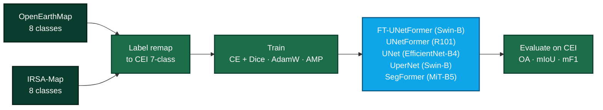

I build full-stack products — Next.js, Vue and React on the front, Python and Node behind them —
and deep-learning systems in PyTorch. The part I care about is what happens after the demo:
getting something to run in production and keep running.

Based in Chiang Rai, Thailand.

### Currently

**Cross-domain land use / land cover segmentation.** Training on [OpenEarthMap](https://open-earth-map.org/)
and IRSA-Map, remapping both 8-class label spaces onto a 7-class CEI land-cover scheme, then
benchmarking five architectures on the target domain. Ambiguous source classes — OEM's developed
space, IRSA's sport surfaces — go to `ignore_index` rather than being folded into bare ground,
so they contribute no loss signal instead of teaching a wrong association.

The seven output classes, in the palette the models actually predict:

### Working with

**Languages**

**Web**

**Backend & data**

**ML**

**Ship it**

### Selected work

- **[lulc_cei](https://github.com/Leng201202/lulc_cei)** — The segmentation research above. PyTorch; a shared label taxonomy module is the single source of truth for both domain mappings and the output palette, so the loader, the metrics and the prediction colours can never drift apart.
- **[Portfolio](https://github.com/Guanjie003/Portfolio)** — My personal site. Next.js 15, React 19, TypeScript and Tailwind, with no other runtime dependencies — sitemap, robots and OG images generated from the route tree.
- **[final-project-mfu-news](https://github.com/Guanjie003/final-project-mfu-news)** — University activity-news portal. Maven multi-module Spring Boot 3.3 back end over JPA, deployed to Google Cloud Run from a GitHub Actions workflow.

### Languages

<picture>
  <source media="(prefers-color-scheme: dark)" srcset="https://github-profile-summary-cards.vercel.app/api/cards/repos-per-language?username=Guanjie003&theme=github_dark">
  
</picture>
<picture>
  <source media="(prefers-color-scheme: dark)" srcset="https://github-profile-summary-cards.vercel.app/api/cards/most-commit-language?username=Guanjie003&theme=github_dark">
  
</picture>

### Elsewhere

